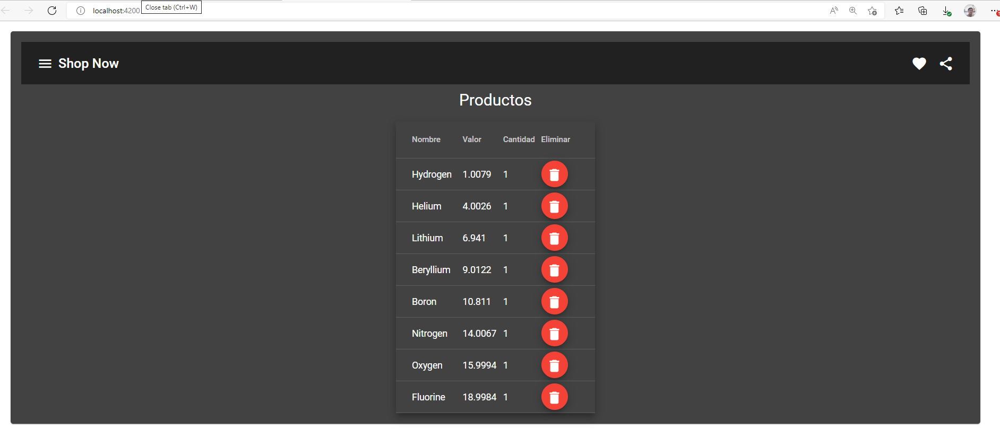

# ShopNow




Este proyecto fue generado con [Angular CLI](https://github.com/angular/angular-cli) versión 14.1.3.

## Servidor de desarrollo
# Crear la aplicación inicial
Desde una consola:
-- Navegar a la carpeta donde se desee crear la aplicación
-- Agregar el comando `ng new nombreApp`  la cual crear la aplicación  

# Ejecutar la aplicación
Ejecutar `ng serve` para un servidor dev. Navegar a `http://localhost:4200/`. La aplicación se recargará automáticamente si cambia alguno de los archivos de origen.


## Build
## Construir

Ejecutar `ng build` para compilar el proyecto. Los artefactos de compilación se almacenarán en el `dist/` directorio.

## Running unit tests

Run `ng test` to execute the unit tests via [Karma](https://karma-runner.github.io).

## Running end-to-end tests

Run `ng e2e` to execute the end-to-end tests via a platform of your choice. To use this command, you need to first add a package that implements end-to-end testing capabilities.

## Más ayuda
Para obtener más ayuda sobre el uso de la CLI de Angular `ng help`, 
[consulte la página de referencia de comandos y descripción general de la CLI de Angular](https://angular.io/cli).


## Code scaffolding
## Andamio de código

Ejecutar ```ng generate component component-name``` para generar un nuevo componente. También puedes usar `ng generate directive|pipe|service|class|guard|interface|enum|module`.

## Comandos NG
Para crear componente sin plantilla de css 

```ng generate component nombreComponente --inline-style```

Para crear componente sin plantilla de html

```ng generate component nombreComponente --inline-template```

Para determinar el nombre del prefijo

```ng generate component nombreComponente --prefix nombreprefijo```

para definir el nombre del selector por ejemplo ```<nombredelselector>```

```ng generate component nombreComponente --selector nombredelselector```

Para crear un componente en un modulo  determinado 

```ng generate component carpeta/nombreComponente --module nombreModulo```

